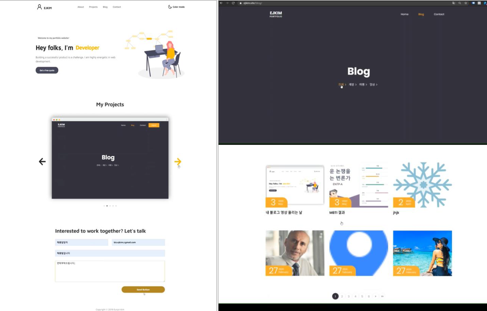
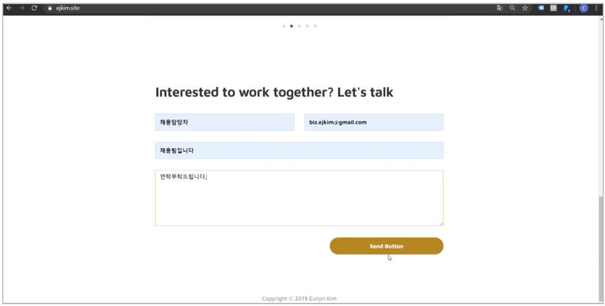
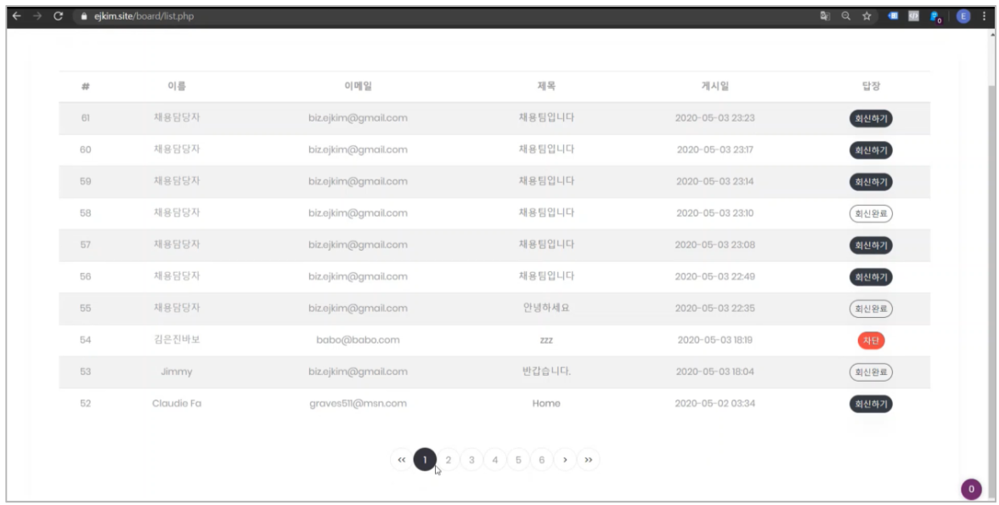
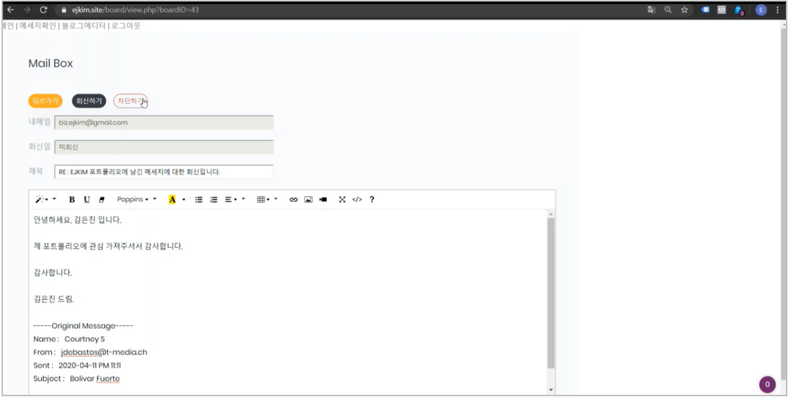
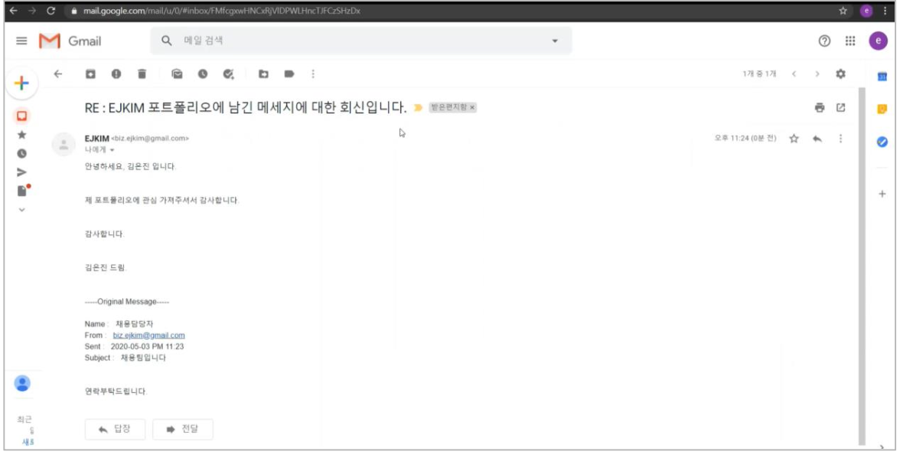
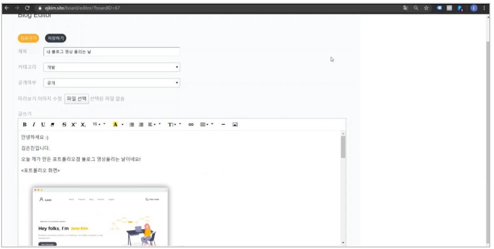
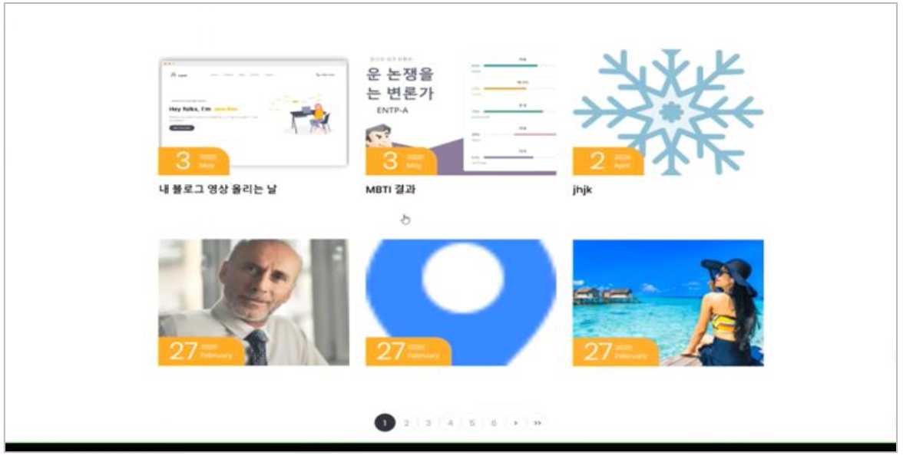

### SW 개발 개인 프로젝트

# 포트폴리오 사이트

## 소개

- 개발기간 : 4주 (기여도 100%)
- 처음 웹을 공부할 때 만들어 본 개인 포트폴리오 및 블로그 입니다.
  이 프로젝트를 통해 서버와 클라이언트를 이해하였고, AWS EC2 클라우드 서버와 도메인 등록으로 처음으로 제 작품을 출시해봤던 사이트 입니다.
- [시연 영상 보기](https://youtu.be/conPoyyAprA) 👀

## 구현기술

- 언어 : HTML, CSS, JAVASCRIPT, PHP
- 웹서버 : Apache
- 데이터베이스 : MySQL
- 운영체제 : Ubuntu
- 프로토콜 : HTTPS, SFTP, SSH, SMTP, POP3
- API/라이브러리 : jQuery, PHPMailer, Bootstrap 4, Fetch API

## 기능

### 1. 클라이언트 페이지 : 포트폴리오와 블로그 페이지

### 2. 클라이언트 페이지 : 컨텍 메시지 전송

### 3. 관리자 페이지 : 컨텍 메세지 확인 및 메일 전송

### 4. 관리자 페이지 : 메일 전송

### 5. 클라이언트 메일함 : 컨텍 메시지 답신 확인

### 6. 관리자 페이지 : 포스터 올리기 및 수정, 삭제

### 7. 클라이언트 페이지 : 포스터 확인

